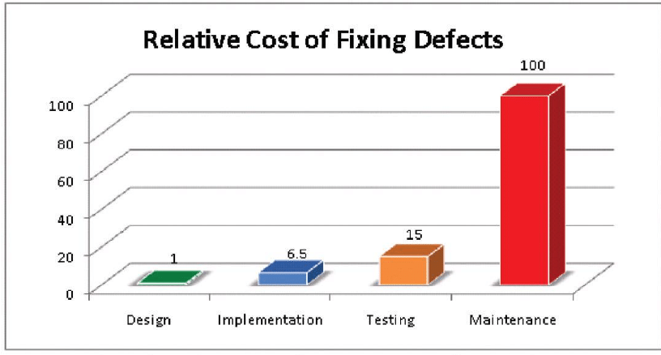

# Dart the perfect CLI language

So let's not be boring, let's go right to the edge of the cliff and hope we don't get thrown over.

Dart with DCli is simply the best language/library combination for building Command Line Interface (CLI) applications and scripts.

That's really all you need to know.&#x20;

You can now get back on with your life knowing which language you need to use when you build your next CLI application.

No? What, you expect me to justify myself?

Well OK, but only because I've got nothing better to do. The hornet's nest near my back door is already mad enough.

Firstly a quick digression. DCli is a Dart package Noojee has developed to make it easy to build CLI Apps.&#x20;

As an organisation we had accumulated an ugly mess of Ruby/Python/Go and Bash scripts. This was partly due to developer preferences and partly because in each case we had a particular set of requirements that (for practical purposes) could only be met by a particular language/library combination.

Needing the devops teams to support 5 languages (at this point in time most of our production systems were written in Java ) made maintenance a nightmare.

Dart was the first language that we thought would actually make it practical to replace all of these languages. Dart biggest shortcoming was the lack of a library that made it easy to write CLI apps.

And so DCli was born. DCli is essentially a swiss army ~~knife~~ library for developing CLI apps. You can read more about [DCli here](https://bsutton.gitbook.io/dcli/). As you read on you will begin to understand what makes Dart an outstanding language for CLI app development; DCli just makes it easier.

So let's start with some metrics as to what makes a good language for building CLI apps.

**The language should:**

1. easily take you from a 10 line script to one that somehow grew into 200,000 lines.
2. be easy to learn
3. not be overly verbose nor overly cryptic.&#x20;
4. works with minimal tooling but has a great IDE
5. allow you to run the script without compiling
6. is fast to start and fast to run
7. is type safe
8. uses a protected memory model
9. comes with a solid debugger
10. allows threading for the occasional heavy lifting
11. makes it simple to call other processes
12. can be deployed as a single file exe without needing a  VM installed.
13. provides good third party package support
14. doesn't encourage the creation of DSLs
15. doesn't encourage the creation of magic code.
16. support cross platform development
17. easy to build and deply

To avoid being lynched, rather than comparing Dart to a range of other languages let's have a look at why Dart is particularly strong in each of these metrics and understand why they are important.

## 1) easily take you from a 10 line script to one that somehow grew into 200,000 lines.

Cli scripts have a habit of evolving rather than being designed.  What started out as a simple 100 line script to automate a couple pieces of the build process,  somehow evolved into the corporation's primary build and deployment tooling.

Dart excels in these type of evolutions. It's easy to throw a quick script together with a single file and a 5 line pubspec.yaml (in Dart a pubspec.yaml defines the packages dependencies).

You can then grow out the directory structure as the collection of dart files grows and pull in third party packages by adding a single line to your pubspec.yaml.

You can create your script with vi or notepad using print statements to debug your code and when you need it, you can move to a full blow IDE like Visual Studio Code (yes I know they aren't allowed to call it an IDE).

## 2) be easy to learn

This is an important metric and one that I think makes Dart stand out.

Dart takes its syntactic heritage from C and has been described and is trivial to learn if you have a Java or Javascript background.


Dart has been described as the Love child of Java and Javascript.


You can port a Java or JavaScript program to Dart with very little effort (I'm talking syntactically here, not about libraries).&#x20;

What this means is that just about anyone can pick up a Dart program and read the code with little training. This perhaps compares sharply with the likes of Ruby that really has a significantly different syntactical structure to the likes of Javascript.

The 'easy to learn' metric is really important for the long term maintenance of programs and the adoption within a team.

Languages like C fail at this miserably. Whilst I loved C when used it, I realized many years later that its simply too expensive to use for most applications. It takes several years to get a junior programmer to the point where you can trust their code and you spend countless hours diagnosing memory corruption. Unless you a writing an OS or some real time app, the days of C are over and even then there are better alternatives.

Rust and Go are designed as a replacement for C and I'm not going to be overly critical of these languages except to say the you don't need to be burdened with Rust's memory management and Go just feels like its too low level for what you need building a CLI app (although I do like Go's coroutines). &#x20;

When I first started using Dart I really found it was a delight to work with. With my background in C/Java/Javascript it was really easy to pick up and start using Dart, I really don't feel I can say the same of Go and Rust.

## 3) not overly verbose nor overly cryptic.&#x20;

This is a real bug bear, and really goes back to point 2.

Java is often (fairly) criticised for being overly verbose and requiring excessive boiler plate code.

At the other end I found this delightful description of Perl:

> Global variables abound. Crazy cryptic syntax. Ridiculous scoping rules with hacked on workarounds.

Great languages need to live in the Goldilocks zone. Not too cryptic, Not too verbose, but ju.......st right; like the warm porridge with honey I had for breaky.


No Bears missed out on breakfast in the making of this post.


Dart feels like it nailed this one. The language is in no way cryptic and it manages to remove lots of the common boiler plate code we get from the likes of Java.

Cryptic languages are hard to maintain. When you come back to the code in two years and  it's just not obvious what it's doing, you have a problem. Really clever solutions, that are had to maintain, are bad solutions.

## 4) Works with minimal tooling

Whilst I hate bash with a passion (that's why I wrote [DCli](https://pub.dev/packages/dcli)) it requires absolutely no tooling, just a simple editor.

Dart almost gets there. You do need to install Dart, but that's it. You don't need a whole tool chain to get a script up and running and you don't even need to compile a script to run it.

You can create a Dart script with vi or notepad and then migrate to using an IDE like Visual Studio Code when you need to.

```dart
sudo apt install dart
dart pub global activate dcli
dcli create hello.dart
./hello.dart
> Hello World
```

## 5) Allows you to run the script without compiling

This is a pretty important one when you writing a little script that you want to quickly iterate on.

Edit/Run not Edit/Compile/Run

Being required to compile between every edit/run cycle just slows things down.

Python and Ruby do a nice job of this as well, but C fails.

## 6) Is fast to start and fast to run

This leads off from the prior point. If you are building a little script then fast turnaround time is important.

Except for languages like C, that require a compile, this is pretty well supported across the common language alternatives.

## 7) Is type safe

So up to this point, I've said nothing really controversial (unless you like Perl but I think I'm safe as most of those devs are either dead or having their afternoon nap), so I guess it's time to upset some people

I know that there will be readers who swear that typeless languages are the only way to go.

This graph tells a different story:



Source: [https://www.researchgate.net/](https://www.researchgate.net)

As the title states, the graph shows the relative cost of fixing a bug at the different stages of an application's life. Fixing a bug in maintenance cost 100 times as much as it cost to fix in design.

Typeless language move more bugs into testing or maintenance, this is a simple fact.

A typed language will generate a compiler error if you trying to use a type inappropriately. The bug is caught during implementation. A typeless language leave those bugs to be found in testing or maintenance.

Dart goes one step further and supports Not Null by Default. Essentially this makes Null another type (String is different from String? where the ? means its a nullable String). This means that most common null pointer exceptions are caught at compile time rather than run time.

What this graph doesn't show is the consequential costs. A bug may take 100 times more to fix in maintenance due to the significant effort required to find and fix, but this doesn't reflect the consequential costs of losing a customer because of a bug.&#x20;

As a case in point. I was recently involved in porting a large and mature Javascript project to Dart.

The first team working on the project converted it to Dart without turning on Darts type safe feature (yes Dart can be used without types).

When we joined the project we were having significant difficulty understanding how the code base worked. It used 30 or 40 different messages types that were being passed around.

So we turned on typed safety and typed each of the messages. What fell out of this? Two things.

1\) the compiler immediately identified some 20 bugs where a field was being accessed on a message that simply didn't have that field. At least 3 of these were causing real bugs in the code.

2\) the team was able to understand the code base as it was now clear what message was being operated on.

So type safety made the code easier to read and fixed a number of bugs simply by compiling the application.

Type safety may take a little more time when writing the code, but you save that in spades in reduced bugs and in lower cost over the full life cycle of the code base.

Languages like Python and Javascript fail completely on this metric and Ruby is only sort of type safe.

## 8 ) Uses a protected memory model

I don't think this is a particularly controversial one, although I do wonder at the amount of C programming that is still going on.

99.9995% of CLI apps do not need to directly manipulate memory (yes I made that stat up).&#x20;

The cost of using a non protected language such as C/C++ is considerable at every stage of an apps life;  coding, debugging, testing  and maintenance.

As someone who once loved C/C++, when I moved my team off C/C++ to Java, I never looked back.

## 9) comes with a debugger

I've met developers who think you don't need a debugger, print statements are sufficient.

Well, I really don't need a car, a horse and buggy will get me there.

You need a debugger and it needs to be a good one and you need to be using it:)

Don't get me wrong, print/log statements still play an important part when debugging but they are just one part of your tool kit.

Most of the languages that you would consider for CLI apps now have reasonable debuggers so this isn't really a point of differentiation.

My preferred Dart IDE, VS Code, also allows remote debugging and debugging within a Docker container which is really handy at times.

## 10) allows threading for the occasional heavy lifting

This isn't actually that important. Must CLI apps tend not to do a lot of CPU intensive work so multiple threads aren't usually that critical, but when you need it, you need it.

Dart provides Isolates which are like threads but with isolated heaps (hence the name).  The downside is you have to jump through a couple of hoops to start an isolate, the upside is it removes most of the complexity/dangers of threads.

Python is probably the language with the biggest problem in this area and is perhaps the slowest of the languages you are likely to use for a CLI app.

A lot of the time performance isn't that critical in CLI apps, but when you need it, its nice to know that its there.

## 11) makes it simple to call other processes

A lot of CLI  app development is calling out to other processes and processing their output and is in fact the corner stone of most Bash scripts.

This needs to be really easy to do.

Dart with DCli excels at this:

```dart
import 'package:dcli/dcli.dart';
void main() {
    var mysqlProcesses = 'ps -A | grep  mysql'.toList();
    "ssh user@remote.server.com 'ls *.txt'".forEach((line) => print(line));
}
```

## 12) can be deployed as a single file exe without needing a  VM installed.

This is one where Dart shines. You can compile a Dart script without any special tooling, copy just the single file exe to another binary compatible machine and run the code.

```dart
sudo apt install dart
dart compile exe hello.dart
chmod +x hello
scp hello someremotemachine:
ssh someremotemachine
./hello
```

As you can see, we didn't need to install some massive tool chain. Dart includes a compiler in the box.

## 13) provides good third party package support

I have to admit that if Dart has a weakness it's this one.&#x20;

Having said that, the main package you need when writing CLI apps is [DCli](https://bsutton.gitbook.io/dcli/). &#x20;


DCli is an API and tooling for building cross platform command line (CLI) applications and scripts using the Dart programming language.


DCli is a  swiss army knife for writing CLI apps in Dart.

```dart
void main(){
    var age = ask(prompt: 'How old are you', valiator: Ask.integer);
    print("Your age is: ${blue('age')}");
    'grep $age people.txt'.run;
    if (exists('/var/log/test.log') {
        delete('/var/log/test.log');
    }
}
```

[pub.dev](https://pub.dev) is the package repository for Dart. As of May 2021 there were 22,000 packages on pub.dev that is double what it was 12 months earlier.

So nothing to sniff at but there are still a number of significant holes in Dart's package eco-system.

These holes are being rapidly filled and with a new focus on Dart server side they will start to move even faster.

As of Dart 2.12, Dart also supports a Foreign Function Interface (ffi) which essentially means that you can call into any existing C library.&#x20;


FFI means that Dart can call any existing C, OS specific API.


One of the nice features of the Dart ecosystem is that once a package is published it can't be unpublished, you will never see a 'leftpad' problem like node had.&#x20;

The likes of Java's package eco system is certainly way more mature as is Python and Ruby's.

## 14) Doesn't encourage the creation of DSLs

I'm look at you Ruby.

DSL's seem like a nice idea, until you have to maintain someone else's code. It's hard enough having to learn a well maintained and documented language without having to maintain a half arsed DSL. Languages like Ruby encourage developers to build code that is just hard to maintain. If feels like a nice idea, but it just ain't so.

## 15) Doesn't encourage the creation of magic code.

And Ruby gets another guernsey.

Ruby has this neat feature where you can call a method on an object when the method doesn't actually exists.

You can then write code that captures the call and do some sweet, sweet magic.

This is really lovely unless you inherit the code and have to work out what it's doing. Static analysis is almost impossible on this sort of code.

There are a number of languages that encourage bad developer behaviour.  Languages that have a history of encouraging developers to use poor programming patterns should be avoided.

## 16) support cross platform development

This falls into the category of a nice to have. Many corporate environments are homogeneous so cross platform isn't that big a deal. Having said that a recent survey I conducted on reddit shows a significant number of Windows and Mac OS users are deploying to Linux servers. Having a single script that works on your dev machine and your production system is nice and saves you having to learn multiple languages or libraries.

## 17) Easy to build and deploy

Dart is the hands down winner on this one.

Darts build system is trivial to use.

Dart's pubspec.yaml is the equivalent of a make file without all of the complexity.

You don't need to install a tool chain as the Dart sdk has everything included in the box.

This is a typical build/deploy cycle:

```dart
sudo apt install dart
git pull https://my.dart/project.git
cd project
dart compile exe bin/main.dart
scp bin/main.exe www.server.com:/opt/main.exe
```

A don't know another language that comes close to the above simplicity.

Dart also doesn't suffer from upgrade hell.  You can upgrade dart and your existing packages are NOT all going to break.&#x20;

Dart can have dll hell problems (at build time but not run time) but these are generally rare and dart has tools to let you resolve this by adding in dependency overrides.

To deploy a Dart exe to a binary compatible system (e.g. linux to linux, windows to windows) you just copy the exe. You don't need to install Dart on the remote system nor copy any dependencies. Copy a single executable install and you are running.

## Conclusion

Declaring a particular language as the 'best' in any category is a fairly fraught conversation but there is no doubt that Dart is an outstanding performer when it comes to building CLI apps.

Dart performs well in virtually every category which simply makes it more flexible than any of the other language choices,

&#x20;Dart's greatest weakness is the maturity of third party packages. For most CLI apps this isn't much of a problem as DCli provides a very solid foundation and the Dart ecosystem is maturing nicely.


Dart is delightful


If you are using Bash script for building your CLI apps,  moving to Dart using the DCli package is a no brainer. Bash has done its dash and it's time to move onto something better.

If you are doing Flutter development then using Dart/DCli for your build/production systems is really the correct choice as a reduction in the no. of languages you run in your environment is of significant benefit.

For those of you coming from a Ruby/Python/C/Go environment, you really should take a look at Dart for future CLI apps. It solves a lot of problems and really is a delight to work with.

If you want to learn more about Dart and DCli:














## About Noojee

Brett is one of the founders of Noojee with a long history in server side development.

Noojee offers technical support and tooling for backend Dart development and is a on of the primary contributors to the [Conduit](https://pub.dev/packages/conduit) project ( a Dart based REST server with built in ORM).
